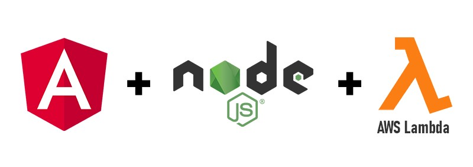

# Super Hero Generator Application

## Introduction

This **Super Hero Generator Application** creates Super Hero names based on your firstname and lastname.
The functionality of this application isn't special at all. But the focus here is more on architecture and security. 



## Serverless Microservice Architecture

The **Angular Frontend** is running in the Azure cloud as a single page application using a service consuming a REST API. The backend part is running as a serverless lambda function in the AWS cloud providing a GET REST endpoint to request a super hero name. 
The **Lambda Backend** receives information about firstname and secondname within parameters passed by a **AWS API Gateway** acting as a proxy gateway. After processing some verification the lambda function does a database call -  using the AWS SDK - to the AWS native NoSQL database **DynamoDB** to return a composed **Super Hero Name**.

### Security

The Angular frontend will be protected with **OpenID Connect** and **OAuth 2.0**.

## Project setup

The frontend application is organised in a classical Angular folder structure.

```
./clientApp
```
Everything related to the backend part can be found here:

```
./server
```

- Deployment: Contains all **bash scripts** to build and deploy Lambda functions via the **AWS CLI**.
- Functions: Contains the actual business logic
- Releases: Packaged and ready to deploy functions are stored here (not pushed).
- Tests: Unit Test implemented with Mocha & Chai and are following the "Should" Guide.

### AWS Configuration

Before you can deploy lambda functions to AWS you need to create a configuration file and configure the _AWS CLI_.

```bash
# File: ./deployment/my.config
ARN="{your-ARN-string}"
functionName="{your-function-name}"
```

### Build and Deploy

To build and deploy a lambda function, own developed scripts are in place to build, deploy and invoke lambda function.

```
./server/deployment
```

## How to use

Check the live demo [here](#).
